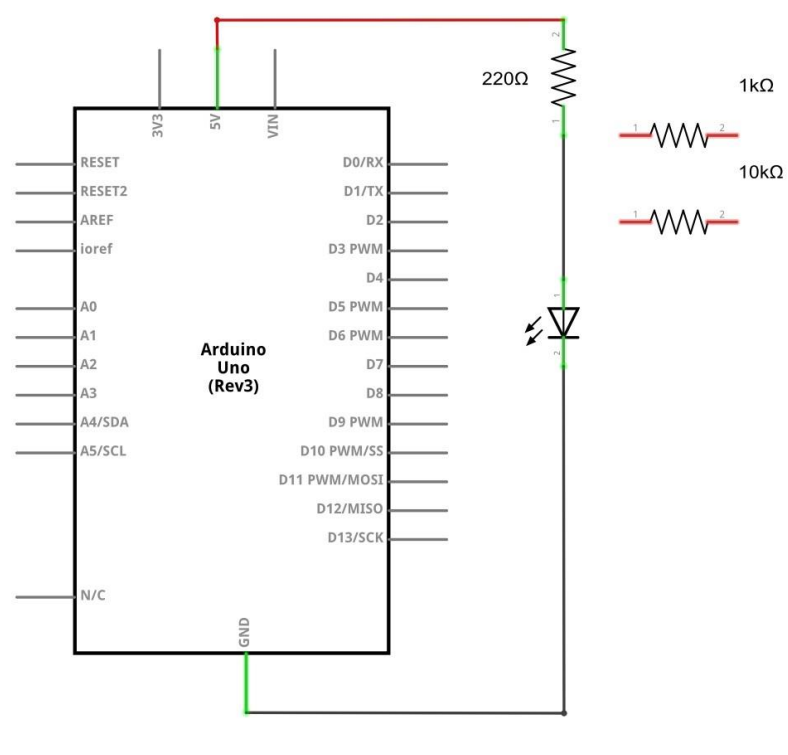
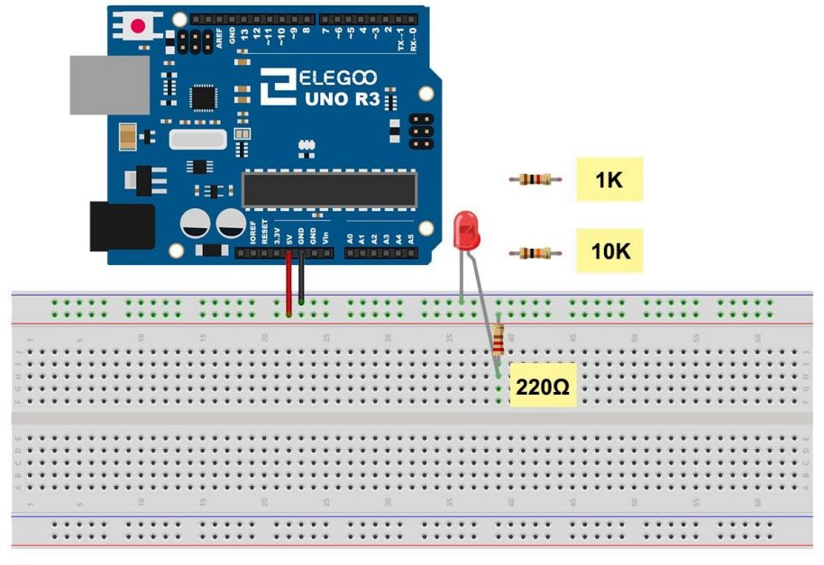
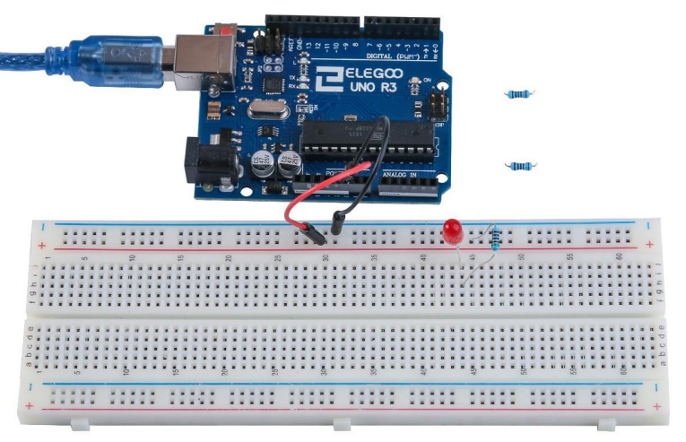

import CodeContainer from "../../components/CodeContainer.astro";
export const components = { code: CodeContainer };

<div id="template">

# Template

Aquí aparecerá un resumen del proyecto con el índice correspondiente.

-   [Componentes requeridos](#componentes-requeridos)
-   [Introducción de componentes](#introduccion-de-componentes)
    -   [Componente 1](#componente-1)
    -   [Componente 2](#componente-2)
    -   [Componente 3](#componente-3)
-   [Conexión](#conexion)
    -   [Esquema](#esquema)
    -   [Diagrama de cableados](#diagrama-de-cableado)
-   [Código](#codigo)
-   [Imagen de ejemplo](#imagen-de-ejemplo)

---

</div>

<div id="componentes-requeridos">

## Componentes requeridos

-   (1) Componente 1
-   (3) Componente 2
-   (1) Componente 3

---

</div>

<div id="introduccion-de-componentes">

## Introducción de componentes

</div>

<div id="componente-1">

### Componente 1

</div>

<div id="componente-2">

### Componente 2

</div>

<div id="componente-3">

### Componente 3

---

</div>

<div id="conexion">

## Conexión

</div>

<div id="esquema">

### Esquema



</div>

<div id="diagrama-de-cableado">

### Diagrama de cableado



---

</div>

<div id="codigo">

## Código

```
void setup() {
  // put your setup code here, to run once:
  pinMode(13, OUTPUT);
}

void loop() {
  // put your main code here, to run repeatedly:
  digitalWrite(13, HIGH);  // write 1 (5V) in 13 pin
  delay(1000);             // wait 1 second
  digitalWrite(13, LOW);   // write 0 (0V) in 13 pin
  delay(1000);             // wait 1 second
}
```

---

</div>

<div id="imagen-de-ejemplo">

##  Imagen de ejemplo



_por {frontmatter.author}_

</div>
